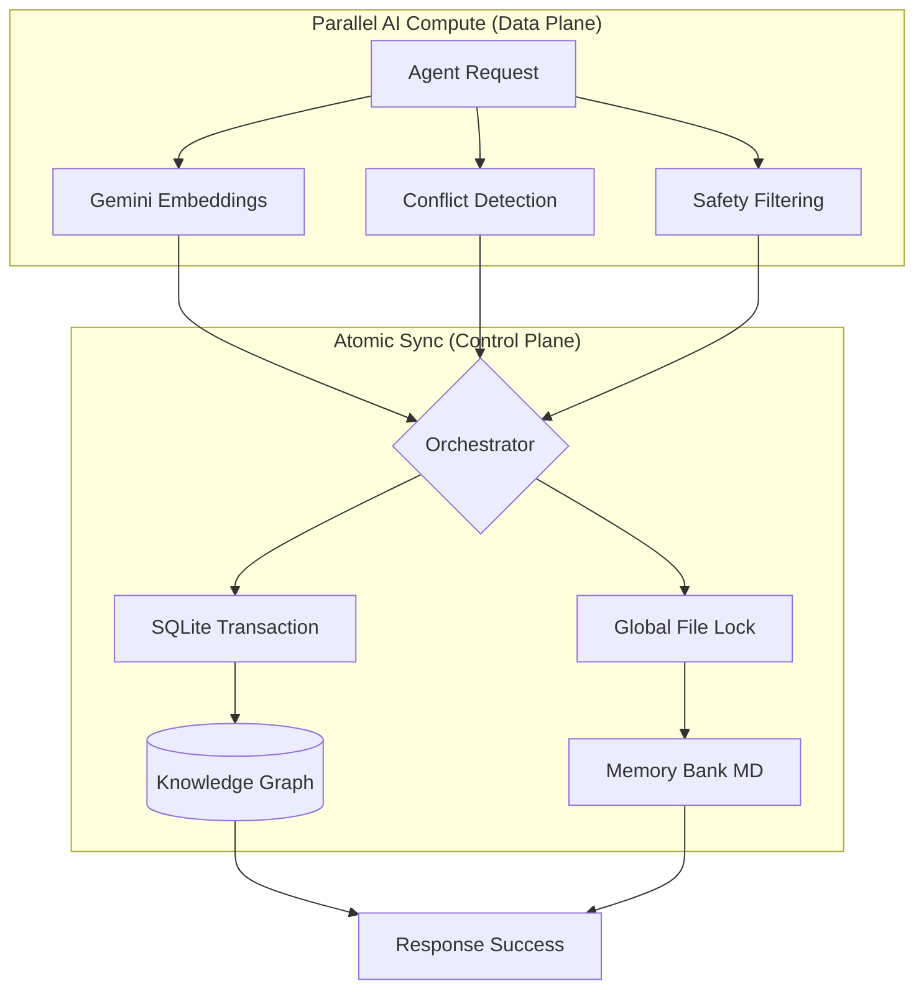

# SharedMemoryServer (Hybrid Memory MCP) 🚀

[](https://github.com/Ayato-AI-for-Auto/SharedMemoryServer)
[](LICENSE)

SharedMemoryServer is a high-performance **Hybrid Memory Layer** designed for multi-agent autonomous systems. It provides a unified "Blackboard" where multiple AI agents can synchronize structured knowledge and project-specific context with sub-second latency.

## 🏗️ Architecture: Compute-then-Write

To support high-concurrency (3-5 simultaneous agents), we implemented a decoupled architecture that separates expensive AI computations from database transactions.



### Why this matters:
- **Lock Contention**: By computing embeddings *outside* the SQL transaction, the database lock duration is reduced from **~2000ms to <50ms**.
- **Real-time Collaboration**: Verified to handle 5 agents performing complex read/write operations in **~1.36 seconds** total.

---

## 🛠️ Unified API (Separated Concerns)

The tools are strictly separated into **Agent Core** (for daily reasoning) and **Admin Maintenance** (for infrastructure management) to prevent cognitive overload and enhance safety.

### 🤖 Agent Core (SharedMemoryServer)
The primary tools for AI agents during task execution.
- **`read_memory`**: Hybrid semantic + keyword search across Graph and Bank.
- **`save_memory`**: High-concurrency atomic update for Graph and Bank mirrors.
- **`synthesize_entity`**: Aggregates distributed information into a coherent master summary.
- **`sequential_thinking`**: Context-aware tool for reflective problem-solving.
- **`get_graph_data`**: Direct access to the knowledge graph state.

### 🛡️ Admin Maintenance (SharedMemoryAdminServer)
Separated from the agent's main toolset to prevent accidental misuse.
- **`admin_get_audit_history`**: Audit logs for all memory changes.
- **`admin_rollback_memory`**: Revert specific changes via Audit ID.
- **`admin_create_snapshot`**: Create point-in-time database backups.
- **`admin_health`**: Deep diagnostics on embeddings and DB integrity.
- **`admin_repair`**: Reconstruct physical workspace files from DB mirroring.

---

## ⚡ Quick Start

1. **Install with uv**:
   ```bash
   uv pip install -e .
   ```

2. **Run Agent Server**:
   ```bash
   uv run shared-memory
   ```

3. **Run Admin Server**:
   ```bash
   uv run shared-memory-admin-server
   ```

4. **Register with Claude/Cursor**:
   ```bash
   uv run shared-memory-register
   ```

## 📈 Quantitative Proof of Value (事実による価値の証明)

SharedMemoryServerは、ユーザーの主観や独自の推定ロジックに頼らず、データベースから抽出された**「観測された事実 (Facts)」**のみでその価値を証明します。

### Fact-Based Report Sample
`get_insights` ツールが提供するレポートの例です：

| 指標 (Metric) | 意味・価値 |
| :--- | :--- |
| **Search Hit Rate (82.5%)** | AIエージェントの全クエリ中、82.5%でメモリから関連情報を提供。「知らない」と答えるリスクを最小化。 |
| **Reuse Multiplier (4.2x)** | 保存された知識は平均4.2回再利用。一度の学習が数倍の効率を生んでいる客観的証拠。 |
| **Knowledge Density** | 知識間の結合度。単なるデータの蓄積ではなく、AIにとっての「概念の地図」としての質を数値化。 |

> [!TIP]
> **No Speculation Policy**: 本システムは「XXドル節約」といった推定値を出しません。すべての数値は、DBのアクセスログに基づく検証可能な事実です。価値の最終的な判断は、これらの実績に基づき、ユーザー自身が行うものと定義しています。

## ⚙️ Advanced Features

### 1. Atomic Mirroring & Recovery
Every write to a Markdown file in the `memory_bank` is mirrored to an internal SQLite table. If a file is deleted or corrupted, the system can automatically reconstruct the entire bank from the database using `admin_repair_memory`.

### 2. Semantic Search & BYOK
Integrated with Google AI Studio's `gemini-embedding-001`.
- **Hybrid Search**: Combines BM25-style keyword matching with vector similarity (using NumPy-powered batch processing).
- **Security**: Project-specific API keys managed via environment variables or `.env`.

### 3. Knowledge Lifecycle
- **Importance Score**: Tracks access frequency and Recency (Decay Factor).
- **Implicit Linking**: Automatically detects entity mentions and links nodes in the knowledge graph during the save process.

---

## 🔒 Privacy & Security
- **Local First**: All data is stored in your local workspace.
- **Principle of Least Privilege**: Tool separation ensures standard agents cannot perform destructive rollbacks or snapshot restores.

## 📄 License
Licensed under the **PolyForm Shield License 1.0.0**. 
- **Permitted**: Personal use, internal business use, modification, and redistribution.
- **Prohibited**: Commercially competing SaaS offerings.

*Built with LogicHive-verified patterns and optimized for the Agentic future.*
