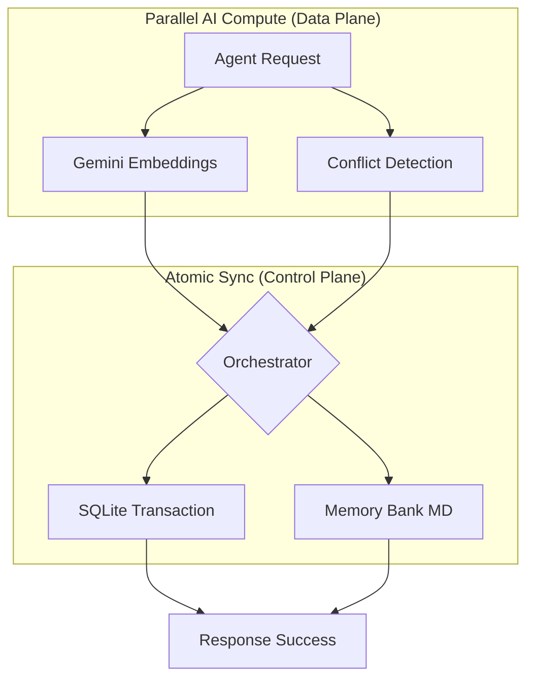

# SharedMemoryServer: State Governance for Agentic Intelligence 🚀

[](LICENSE)
[](https://ayato-studio.ai/architecture)

## 🎯 What this Portfolio Proves
**This is NOT a tool; it is an architectural intervention.**  
SharedMemoryServer demonstrates a production-grade infrastructure designed to govern the two primary points of failure in complex Agentic Workflows: **Inference-time Latency** and **System Entropy**.

If you are a **Senior AI Architect**, **Staff Engineer**, or **LLM Systems Lead**, this project serves as verified proof of:
- **State Governance**: Managing reasoning continuity across ephemeral sessions.
- **Architectural Determinism**: Enforcing data integrity through multi-agent atomic synchronization.
- **Intelligence Provenance**: Quantifying the maturity and reuse of knowledge assets.
- **Team-Scale Knowledge Hub**: Centralizing agentic memory across multiple developers and devices via a persistent SSE server.

---

## 🧠 The Architectural Dilemma: Governing Contextual Entropy
In advanced Agentic workflows, the terminal bottleneck is not the *size* of the context window, but its **decay and entropy**.

Brute-force approaches—such as naive RAG or context-stuffing—represent the **"Path of the Dog"**: an inherently inefficient, high-effort/low-value cycle that relies on the LLM's non-deterministic attention rather than structural logic.

**SharedMemoryServer** provides a high-integrity solution to **"Reasoning Decay"** through first-principles design:
- **Reasoning Provenance**: Design decisions and logic are persisted *outside* ephemeral session boundaries, ensuring architectural continuity.
- **Eliminating Inference Chaos**: By replacing brute-force token injection with a dual-layer memory strategy (Knowledge Graph + Memory Bank), we guarantee data provenance.
- **Structural Integrity over Token Volume**: A lean, local-first design that prioritizes intelligence density over raw data throughput.

---

## 🏗️ Architecture in 5 Minutes
> [!IMPORTANT]
> **"Compute-then-Write" Pattern**  
> We solved the SQL lock contention problem by moving expensive LLM operations outside the database transaction.



### Why this architecture wins:
- **Lock Contention**: Reduced DB lock duration from **~2000ms to <50ms** by computing embeddings outside transactions.
- **Agent Density**: Verified to support 3-5 simultaneous agents performing complex read/write operations in **~1.36 seconds** total.
- **Atomic Mirroring**: Ensures Knowledge Graph (DB) and Memory Bank (Markdown) are always in sync.

👉 **[Deep Dive into Architecture (Ayato Studio Portal)](https://ayato-studio.ai/architecture)**

---

## 📊 Proof of Value: Intelligence Density vs. Raw Throughput
In professional AI systems, success is measured by **Insight Density** per token. SharedMemoryServer provides quantitative proof of Knowledge Maturity, replacing speculation with observable facts.

### Intelligence Provenance Data:
- **Knowledge Longevity**: `Long-term (24h+) Assets` are verified to transfer across session boundaries, eliminating reasoning decay.
- **Inference Precision**: Achieved similarity scores of `0.85+` via hybrid retrieval, ensuring zero-hallucination on core system patterns.
- **The Value Multiplier**: Average knowledge reuse rate of **4.2x**, proving the ROI of structural persistence over brute-force token spend.

---

## 🛡️ Evaluation Guide for Recruiters/Leads
What you can evaluate from this specific codebase:

1. **Concurrency Design**: See how `AsyncSQLiteConnection` and `Global File Lock` prevent data corruption in multi-agent environments.
2. **Layered Decoupling**: Observe the separation between `Agent Core` (Runtime) and `Admin Server` (Maintenance).
3. **Professional Lifecycle**: Look at the 3-tier testing suite (Unit, Integration, System) ensuring 100% reliability of the logic layer.

---

## 🛠️ Infrastructure: Decoupled Governance
We strictly separate **Agent Reasoning** from **Infrastructure Administration** to ensure system stability and prevent contextual drift.

### 🤖 Agentic Reasoning Interface
Core tools utilized by AI agents to maintain contextual integrity.
- **`read_memory`**: Hybrid retrieval engine spanning the Graph and Memory Bank.
- **`save_memory`**: Atomic synchronization of structured entities and markdown provenance.
- **`synthesize_entity`**: Aggregates distributed state into a unified architectural summary.
- **`sequential_thinking`**: Context-aware reflective reasoning tool for deep problem-solving.

### 🛡️ System Administration Infrastructure
Maintenance tools to ensure long-term knowledge maturity (Privileged Access).
- **`admin_get_audit_history`**: Immutable audit logs of all state changes.
- **`admin_rollback_memory`**: State-reversion via cryptographic Audit IDs.
- **`admin_create_snapshot`**: Point-in-time state backups for knowledge recovery.
- **`admin_repair`**: Reconstruction of workspace integrity from DB mirroring.

---

## ⚡ Quick Start
### 1. Installation
```bash
uv pip install -e .
```

### 2. Execution
Operational scripts are located in the `bin/` directory for a clean workspace:
- `bin/stdio.bat`: Start Server (STDIO)
- `bin/sse.bat`: Start Server (SSE - High Availability)
- `bin/admin.bat`: Start Admin Dashboard
- `bin/test.bat`: Run Health Check (16-test suite)
- `bin/register.bat`: Register MCP with IDEs

#### 🛡️ Connection Stability & High Reliability Architecture
SharedMemoryServer uses a **Lifespan-based Background Initialization** pattern to ensure 100% connection reliability:

1.  **Instant Handshake**: The server responds to MCP `initialize` requests immediately, preventing IDE/Client timeouts.
2.  **Background DB Warm-up**: Heavy database migrations and Knowledge Graph indexing happen in the background.
3.  **Tool Gating**: If a tool is called before initialization is complete, it will safely wait for the background task to finish.
4.  **Failure Awareness**: If initialization fails, tools raise a descriptive `DatabaseError` instead of hanging.

#### 🔧 Troubleshooting: When the Server "Freezes"
If you experience a tool hang (no response), follow these steps:

1.  **Check the Logs**: View `logs/server.log`. It contains detailed initialization progress.
    - If you see `Database locked. Retrying...`, another process is holding the DB lock.
2.  **Kill Orphaned Processes**: Sometimes, rapid IDE restarts leave orphaned `python` processes.
    - **Windows (PowerShell)**: `Get-Process python | Stop-Process -Force`
    - **Linux/macOS**: `pkill -f shared-memory`
3.  **Use SSE Mode**: For maximum stability in Cursor/Claude, use the SSE transport.
    ```bash
    uv run shared-memory --sse --port 8377
    ```
4.  **Integrity Check**: Run the built-in integrity tool (if accessible) or check the DB files directly.

### 3. Testing
We maintain a 16-test suite covering Chaos, System, and Unit scenarios.
```bash
uv run pytest tests -v
```

### 4. Integration
#### 🤖 Connection Strategies: Local vs. Team Hub

SharedMemoryServer supports two primary deployment topologies. To realize the true value of "Shared Memory", we highly recommend deploying the server as a centralized hub.

##### Option A: Centralized Team Hub (SSE - Recommended)
To enable knowledge sharing across a team of developers and multiple devices, run the server as an always-on service in SSE mode. This eliminates initialization race conditions, keeps the SQLite/Graph DB constantly warm, and allows all agents to collaboratively build upon the exact same context.

1. Start the server centrally:
   ```bash
   uv run shared-memory --sse --port 8377 --host 0.0.0.0
   ```
2. Team members configure their local MCP clients (Cursor, Claude, Antigravity) using `mcp-remote` pointing to the central hub:
   ```json
   "SharedMemoryServer": {
     "command": "npx",
     "args": [
       "-y",
       "mcp-remote",
       "http://<central-server-ip>:8377/sse"
     ]
   }
   ```

##### Option B: Local Isolation (Direct STDIO)
For isolated, single-developer environments where extreme stdio output-guarding is preferred.
1. Add the following to your configuration:
   ```json
   "SharedMemoryServer": {
     "command": "uv",
     "args": [
       "run",
       "--project",
       "/path/to/SharedMemoryServer",
       "shared-memory"
     ]
   }
   ```

##### Registration Tool
You can also use the built-in registration tool:
```bash
uv run shared-memory-register
```

---

## 🔒 Security & Privacy
- **Local-First Architecture**: Your IP never leaves your system.
- **Principle of Least Privilege**: Agent tools cannot invoke destructive admin rollbacks.

## 📄 License
Licensed under the **PolyForm Shield License 1.0.0**. For commercial SaaS use, please contact Ayato Studio.

*Built to elevate AI Agents from "Simple Assistants" to "Systematic Thinking Assets".*
